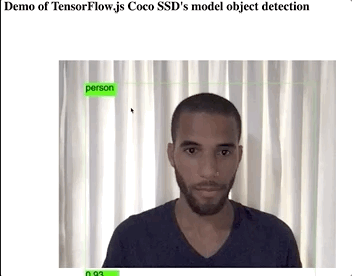

## In-browser real-time object detection with TensorFlow.js and React

This repo contains the code needed to build an object detection web app using TensorFlow.js and React. The app, uses the computer's webcam stream to perform real-time object detections in every frame it receives.

### The model
The model featured in the app, is a pre-trained [COCO SSD](https://github.com/tensorflow/tfjs-models/tree/master/coco-ssd) system.

### Requirements
Only a browser and a local web server.

### Instructions
To launch the web app, go to the root directory of the app, and launch a web server. An easy way to create a one is with Python, using the following command `$ python3 -m http.server` or `$ python -m SimpleHTTPServer` if you're using Python 2.

Once the server is up and running, open your browser, and go to http://localhost:8000/, and you'll be greeted by a prompt window requesting permission to access the webcam. Upon accepting said request, wait a bit until the model is downloaded and voila, rejoice with the glory of out-of-the-box deep learning. Have fun!

### Tutorial
For a complete tutorial, and a theory lesson about the model and what's under the hood, please refer to the following link: [In-Browser Object Detection Using Tensorflow.js](https://nanonets.com/blog/object-detection-tensorflow-js/)

This is the app in action.

